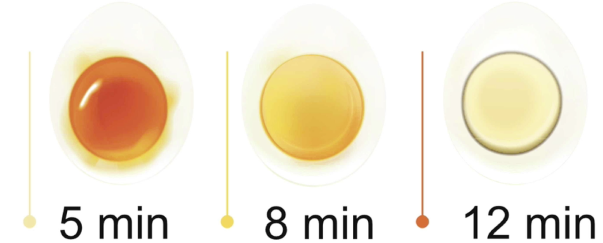
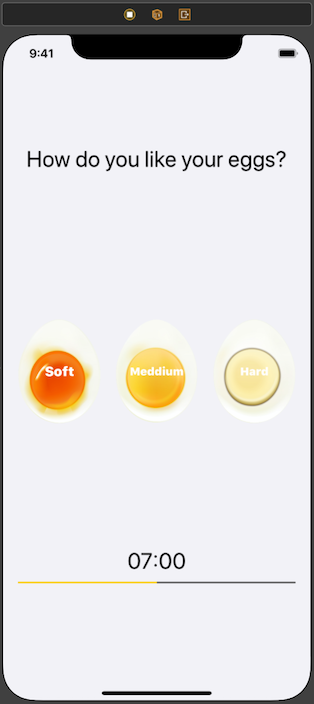
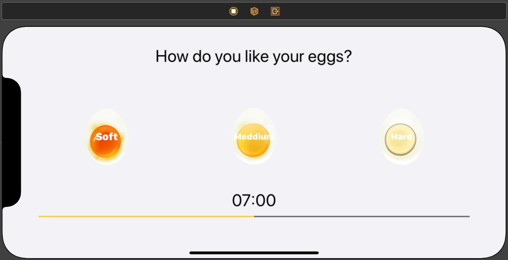

# EggTimer
Egg Timer iOS APP native

Applying the concepts:

* IBOutlets & IBActions
* AutoLayouts
* How to play sound using AVFoundation and AVAudioPlayer.
* Error handling using try and catch.
* Control Flow
* Diccionaries
* Optionals

# Functionality
This App will be able to time your eggs to perfection.
So if you want softer eggs, you'll never have to eat hard eggs again. Unless you line hard eggs, in which, you will get really solid eggs.

## Eggs Time

## Portrait

## Landscape

